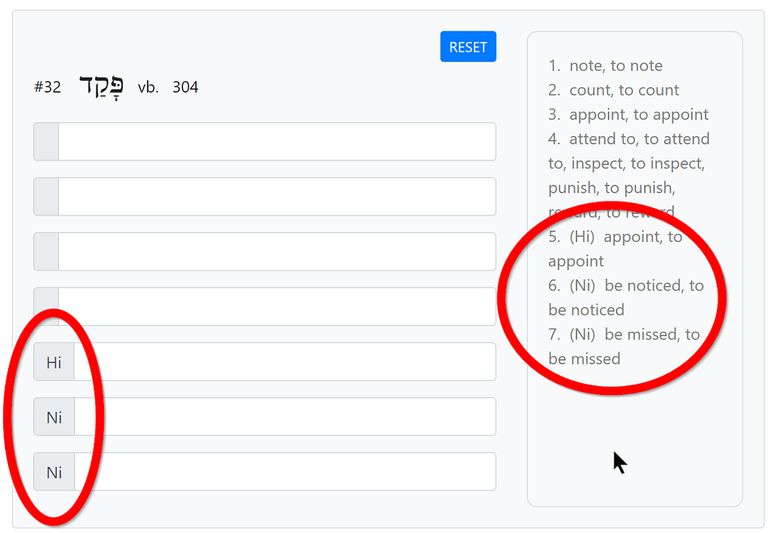

# Vocab Helper

Vocab Helper allows the user to practice their knowledge of Biblical Hebrew words with a custom-made practice quiz. The quizzes are designed for practicing rather than for testing.

Vocab Helper was made with:

- HTML, CSS, JavaScript, jQuery
- [Bootstrap](https://getbootstrap.com/) for responsive web design
- [GSAP](https://gsap.com/) for animation
- [JSON](https://www.json.org/json-en.html) for vocabulary data

You can try using it [here](https://hebrewpracticequiz.netlify.app/)!

## Features

- Every question has multiple answer input fields to cover the lexical range of each word.
- The `SCORE` box keeps track of the number of questions answered. If any of the multiple definitions of a word are correctly entered, that question is considered answered.
- Hovering the mouse over the hint box reveals the answers for a quick reminder.
- Answering the question correctly autofocuses on the next question.
- The `tab` key moves to the next question.
- The left side of each answer field specifies the word type.
- Incorrect answers are indicated by a the element shaking briefly.

## How to start the quiz

- Click on `QUIZ` in the navigation bar.

- Enter the range of words you wish to view using the `Start` and `End` input fields.

- The range cannot exceed the total of 653 words that are available.

- Enter the number of questions you want the quiz to have in the `# of Q` input field.

- The maximum number of questions allowed is 100.

- If the number of questions is lower than the range of words, the quiz will consist of a random selection from the range.

- click `START` to populate the quiz.

- The `SCORE` window on the top right shows the quiz stats once the user starts answering the questions.

## Components of the question element

- Each question card contains:

  - Question number
  - The Hebrew word
  - Word type - `n.`, `vb.`, `adj.` etc. See [Abbreviations](## Abbreviations).
  - Frequency of occurrence in the Bible
  - Answer input fields, including on the left side the word category, such as verb stems (Hiphil, Niphal, etc.) - See [Abbreviations](## Abbreviations).
    
  - `RESET` button
  - Definition hint box, with the words `HOVER TO SEE DEFINITIONS`

- Press `tab` to navigate through each of the answer input fields.

- Type in your answer in the answer input field.

- If the user-supplied answer matches any of the definitions that are hidden inside the word hint box, the answer input field will turn green and become immutable.

- If the user-supplied answer is incorrect, the answer input field will shake and reset the text value.

- A correct answer already submitted once cannot be used again in a different answer input field for the same Hebrew word.

- Click on `RESET` to reset the answer input fields for that Hebrew word.

- Hover over the word hint box to see all of the definitions for that word.

- Notice that some definitions have multiple entries separated by `,`. For example, a definition might be something like `2. take, to take`. In this case, both `take` and `to take` will be considered correct answers.

- Click on `TOP OF PAGE` to go back to the top of the page.

## How to see the vocab list

- Click on `VIEW` in the navigation bar.

- Enter the range of words you wish to view using the `Start` and `End` input fields.

- The range cannot exceed the total of 653 words that are available.

## Abbreviations

The abbreviations used in the `Category` column in the `VIEW` page:

| Abbreviation | Definition               |
| ------------ | ------------------------ |
| adj.         | adjective                |
| adv.         | adverb                   |
| art.         | article                  |
| cj.          | conjunction              |
| inf.         | infinitive               |
| n.f.         | noun, feminine           |
| n.f./m.      | noun, feminine/masculine |
| n.m.         | noun, masculine          |
| n.m./f.      | noun, masculine/feminine |
| prn.         | pronoun                  |
| prp.         | preposition              |
| prt.         | particle                 |
| ptc.         | participle               |
| subs.        | substantive              |
| vb.          | verb                     |

The abbreviations used for the type of each word in the `QUIZ` page:

| Abbreviation | Type                                                   |
| ------------ | ------------------------------------------------------ |
| ---          | `Qal`. If a verb stem is not specified, Qal is assumed |
| concept      | Explains the concept of the word rather than a gloss   |
| fig.         | figurative                                             |
| Hi           | `Hiphil` verb stem                                     |
| Hishtaphel   | `Hishtaphel` verb stem                                 |
| Hit          | `Hithpael` verb stem                                   |
| Ni           | `Niphal` verb stem                                     |
| Pi           | `Piel` verb stem                                       |
| plural       | The plural use of the word                             |
| ptc.         | participle                                             |
| Pu           | `Pual` verb stem                                       |
| substantive  | substantive                                            |
